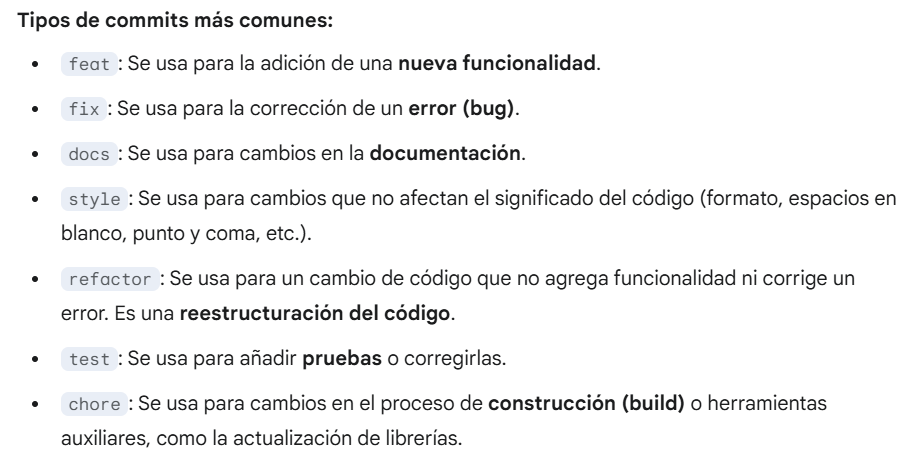

# Análisis de datos aplicado al deporte de alto rendimiento

Este repositorio contiene el código y los recursos utilizados para la resolución de la materia Aprendizaje Automático de Grandes datos, en el marco de la carrera de Ingeniería en Computación de la Universidad Nacional de Rafaela (UNRaf). 

El proyecto se enfoca en el análisis de datos deportivos de alto rendimiento.

## Origen de los datos
Los datos para este proyecto provienen de la alianza entre Hudl y StatsBomb, dos empresas líderes en tecnología y análisis de datos para el deporte. 

## Posibles análisis
Con una base de datos tan sólida, el análisis puede dirigirse en diversas direcciones, como predicciones, prescripciones y análisis exploratorios. Estos estudios pueden ser a nivel individual (cada jugador) o a nivel grupal (por equipo o competencia), con el objetivo de hallar patrones que permitan mejorar y perfeccionar a equipos y jugadores. 
 
## Acceso al dataset y recursos
Se puede acceder al dataset y a los recursos a través de la API de StatsBomb. La empresa provee un webinar para introducir el uso de sus datos. 

Página de presentación del dataset: https://www.hudl.com/blog/hudl-statsbomb-free-euro-2025-data 

Link al webinar (Python): https://www.hudl.com/blog/using-hudl-statsbomb-free-data-in-python

## Presentación
Link de la presentación realizada en clase: https://docs.google.com/presentation/d/1lLOb5RIyX5izsv-DcGx-99z_DnTfakcT/edit?slide=id.p1#slide=id.p1

## Consideraciones dentro del repositorio

